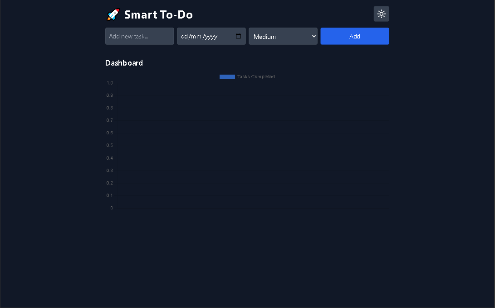

# ✅ Smart To-Do

A powerful and modern to-do list app that helps you stay productive with task priorities, deadlines, and a visual dashboard.

### 🔗 Live Demo
👉 [View Live Site](https://github.com/abdulsalamkhan441/smart-todo.git)

---

## 🚀 Features

- Add, edit, and delete tasks
- Assign due dates and priority levels
- View task completion chart (bar graph)
- Light/dark theme toggle
- LocalStorage persistence

---

## 🧰 Tech Stack

- React
- Tailwind CSS
- Chart.js
- Vite

---

## 📸 Screenshot



---

## 📦 Getting Started

1. Clone the repo:
```bash
git clone https://github.com/abdulsalamkhan441/smart-todo.git
